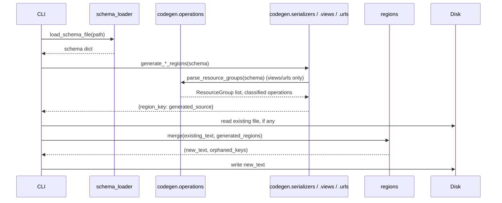

# Architecture

## Pipeline



## Module map

| Module | Responsibility |
| --- | --- |
| `schema_loader` | Parses schema text (JSON or YAML) from any source. |
| `naming` | Identifier conversion (`to_class_name`, `to_snake_case`, resource grouping) - the single sanitization boundary between schema-derived text and generated Python identifiers. |
| `type_mapping` | Maps one JSON Schema field definition to a DRF field expression. |
| `codegen.operations` | Groups paths by resource and classifies each operation. |
| `codegen.serializers` / `.views` / `.urls` | The three file generators. |
| `regions` | Marker-based parsing and idempotent merging of generated code into an existing file. |
| `scaffolder` | Orchestrates: generate all three files, merge with disk, write. |
| `checker` | Orchestrates: generate, compare against disk, report drift - never writes. |
| `cli` | The `drf-api-reverse` console script. |
| `management.commands.scaffold_api` | The optional Django wrapper. |

## Idempotent regeneration: how it actually works

Every generated file is split into named, marker-delimited regions:

```python
# === BEGIN DRF-API-REVERSE GENERATED: serializer:Article ===
class ArticleSerializer(serializers.Serializer):
    ...
# === END DRF-API-REVERSE GENERATED: serializer:Article ===
```

`scaffold()` regenerates every region's *body* from the current schema
on every run, but only ever replaces text between one region's own
markers. Concretely, on a re-run:

1. The file is parsed into a list of chunks: literal text, and
   marker-delimited regions (see `regions.parse_regions`).
2. For each region key the schema still produces, its body is replaced
   with freshly generated code - even if nothing about that specific
   schema entry changed, since diffing "did this specific class change"
   is not attempted; the whole point is that the *file* only changes
   where the *content* changed, which a plain byte-for-byte rewrite of
   the whole file would not give you, but simply regenerating a body
   that happens to be identical to what's already there produces no
   diff either.
3. Anything that is not inside a recognized region - a hand-written
   import at the top, a helper function you added at the bottom, code
   between two regions - is copied through completely untouched.
4. A region key present in the file but no longer produced by the
   schema (a component schema or resource group that was removed) is
   left in place, not deleted, and reported back as **orphaned** (see
   `FileResult.orphaned_keys`/`FileDrift.orphaned_keys`) - this package
   never discards code without being told to.

This is why the generated `raise NotImplementedError(...)` inside a
`ViewSet` method survives being *replaced* with your real
implementation: once you edit inside the method body, that edit is
inside the region (the `def ...:` line and its body are part of the
generated text), so **the next `scaffold` run will overwrite it back to
the stub** unless the method itself is removed from what gets
generated - which only happens if the underlying schema operation goes
away. In practice this means: keep real logic in the model/serializer's
own methods, or immediately delegate from the stub to a
non-generated helper function defined outside any region, rather than
writing substantial logic directly inside a generated method body.
See [FAQ](faq.md#why-would-my-hand-written-viewset-logic-get-overwritten)
for the concrete failure mode this warns about.

## Resource grouping and operation classification

One `ViewSet` is generated per top-level, non-parameter path segment -
`/articles/`, `/articles/{id}/`, and `/articles/{id}/comments/` all
belong to the group `"articles"` (`naming.resource_group_key`).
Deliberately no English singularization/pluralization is attempted
(`"categories"` stays `"categories"`, not `"category"`): that heuristic
is wrong often enough on real resource names to cause more confusion
than it resolves.

Within a group, each `(path, method)` operation is classified by shape,
not by name:

| Path shape | Example | Classification |
| --- | --- | --- |
| One literal segment | `/articles/` | `collection` - `GET` → `list`, `POST` → `create` |
| Two segments, second a param | `/articles/{id}/` | `detail` - `GET` → `retrieve`, `PUT` → `update`, `PATCH` → `partial_update`, `DELETE` → `destroy` |
| Three segments: literal, param, literal | `/articles/{id}/comments/` | `nested_action` - a `@action(detail=True, ...)` method |
| Anything else (4+ segments, 2+ params) | `/articles/{id}/comments/{cid}/` | `unsupported` - recorded as a comment in the generated `ViewSet`, not silently dropped |

This table is exhaustive - see
`src/drf_api_reverse/codegen/operations.py` for the implementation;
there is no additional hidden heuristic. `unsupported` operations are
never invented workarounds for; they are surfaced so you can wire them
up by hand with full information about what's missing (see
[FAQ](faq.md#why-did-an-operation-not-get-scaffolded-at-all)).

## Serializer field generation and dependency ordering

Each `components.schemas` entry becomes one `serializers.Serializer`
subclass (never `ModelSerializer` - a design-first contract has no
model yet by definition). Fields map from JSON Schema type/format/enum
via `type_mapping.field_spec`; a `$ref` to another component schema
becomes a nested serializer field (`AuthorSerializer()`, or
`AuthorSerializer(many=True)` for an array of refs).

Because a nested serializer field must reference an already-defined
Python class, classes are emitted in dependency order via
`graphlib.TopologicalSorter` (`codegen.serializers._emission_order`). A
genuine circular reference between two schemas (`A` references `B`
which references `A`) cannot be expressed as two in-order class
definitions in plain Python; the class encountered second in such a
cycle gets a plain `DictField()` in its place, with a comment
explaining why - see
[FAQ](faq.md#what-happens-with-a-circular-schema-reference).

## Design decisions

### Method bodies are exactly `raise NotImplementedError(...)`, nothing cleverer

No attempt is made to guess a "reasonable default" implementation
(e.g. wiring up a queryset automatically) - a design-first contract by
definition precedes the model/business logic that would make such a
guess meaningful, and a wrong guess that silently "works" is worse than
an explicit, impossible-to-miss `raise`.

### Schema-derived text is never interpolated unescaped into generated source

Every place a schema-derived string (a path, a `$ref` target, an
`operationId`) is written into generated Python is either passed
through `naming.to_class_name`/`to_snake_case` (which strip everything
but alphanumerics), through `repr()` (for string literals and `@action`
arguments), or through `naming.comment_safe` (for `#`-comments, which
collapses embedded newlines) - never a raw f-string substitution into a
quoted literal or comment. See [Security](security.md) for the threat
this specifically defends against.

### No dependency on `drf-nested-routers`

Nested collection paths (`/articles/{id}/comments/`) are scaffolded as
a `@action`-decorated method on the parent `ViewSet`, registered
through a single `DefaultRouter`, rather than pulling in
`drf-nested-routers` for a second router layer - this keeps the
generated `urls.py` dependency-free beyond DRF itself, at the cost of
only supporting one level of nesting automatically (see the
classification table above).
