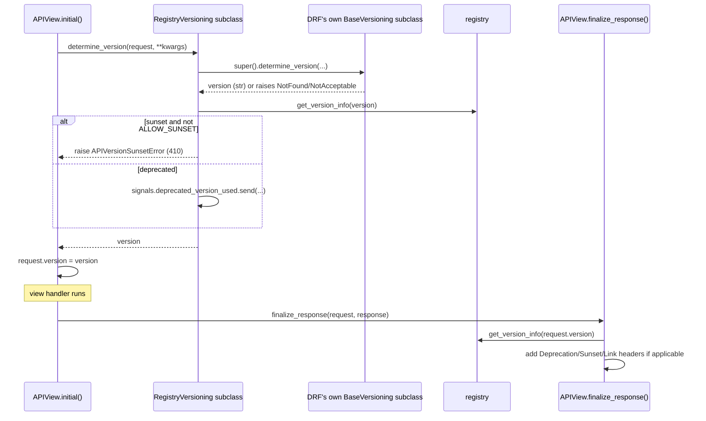

# Architecture

## Pipeline

## Module map

| Module | Responsibility |
| --- | --- |
| `settings` | The `API_VERSIONING` setting, validated and cache-invalidating. |
| `registry` | `VersionInfo` + read-only accessors over `VERSIONS`. |
| `versioning` | The five registry-aware versioning scheme subclasses. |
| `mixins` | `DeprecationHeaderMixin` - the response-header side. |
| `exceptions` | `UnknownAPIVersionError`, `APIVersionSunsetError`. |
| `signals` | `deprecated_version_used`. |
| `management.commands.list_api_versions` | A scriptable inventory of every version's status. |

## Why a mixin, not a Django middleware, for response headers

DRF sets `request.version` on its own `Request` wrapper instance,
created and discarded inside `APIView.dispatch()` - a plain Django
middleware's `HttpRequest` reference (captured before DRF ever wraps
it) never sees this attribute, since DRF's `Request.__setattr__` is not
overridden to forward arbitrary attribute assignments back onto the
wrapped `_request`. Concretely: `request.version = "v2"` inside
`dispatch()` sets an attribute on the ephemeral DRF `Request` instance,
not on the underlying Django `HttpRequest` a middleware holds. This is
why `DeprecationHeaderMixin` overrides `finalize_response` (a DRF-level
hook that has access to that same `Request` instance) instead of being
a Django `MIDDLEWARE` entry.

## Why each versioning class subclasses a specific DRF scheme, not `BaseVersioning` directly

Each class (`URLPathVersioning`, `NamespaceVersioning`,
`AcceptHeaderVersioning`, `QueryParameterVersioning`,
`HostNameVersioning`) inherits from DRF's *concrete* scheme of the same
name, not `BaseVersioning`. This means the actual version-resolution
mechanics (parsing a URL kwarg, an `Accept` header parameter, a query
parameter, a URL namespace, or a hostname) are entirely unchanged, real
DRF code - this package only overrides `allowed_versions`,
`default_version`, and wraps `determine_version` to add registry
enforcement afterward.

## `allowed_versions`/`default_version` as properties, not `__init__` overrides

DRF versioning scheme instances are stateless and typically constructed
fresh per-request (`self.versioning_class()` inside
`APIView.determine_version`) - there is no instance-level state to
initialize. Overriding `allowed_versions`/`default_version` as
`@property` means every access reflects the registry's *current* state
(honoring `@override_settings` in tests, and any settings reload)
without needing to hook `__init__` or cache anything.

## The unknown-version status code matches the wrapped scheme's own convention

DRF's own schemes disagree on the right status code for "this version
doesn't exist": `URLPathVersioning`/`NamespaceVersioning`/
`HostNameVersioning`/`QueryParameterVersioning` all raise `NotFound`
(404); `AcceptHeaderVersioning` raises `NotAcceptable` (406), since an
unrecognized `Accept` header parameter is a content-negotiation
failure, not a missing resource. `UnknownAPIVersionError` preserves
this distinction - `_RegistryVersioningMixin.determine_version` catches
whatever `APIException` the wrapped scheme's own `determine_version`
raises and re-raises `UnknownAPIVersionError` with that same
`status_code`, only replacing the message with one that names the
specific rejected value and lists what's actually supported.

## `NamespaceVersioning` is the one scheme where an unresolved version can reach the registry as `None`

DRF's `NamespaceVersioning.determine_version` returns
`self.default_version` directly, without calling `is_allowed_version`
at all, when the current URL has no matching namespace. Every other
scheme calls `is_allowed_version` unconditionally after resolving a
version (even the resolved default) - and because this package's
`allowed_versions` is always non-empty (computed from the registry),
that check already rejects an unresolvable version for those four
schemes before `determine_version` can return at all. Only for
`NamespaceVersioning`, with `default_version` itself `None`, can `None`
genuinely reach the post-resolution registry check - handled by
returning early with no enforcement, since there is no version to look
up.

## Dates are compared using Django's current date, not the system clock's

`VersionInfo.is_deprecated()`/`is_sunset()` compare against
`django.utils.timezone.now().date()`, not `datetime.date.today()` - the
latter uses the server process's local system timezone, which can
differ from Django's configured `TIME_ZONE` (or from another server in
a multi-region deployment), causing an off-by-one-day discrepancy right
at midnight boundaries. Passing an explicit `as_of=` argument bypasses
this entirely, for deterministic testing.
