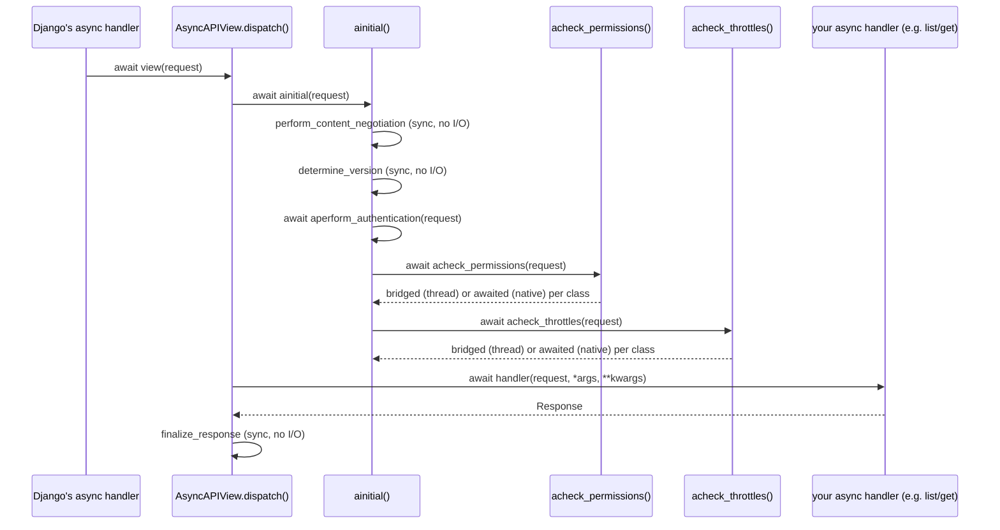

# Architecture

## Request pipeline



## Module map

| Module | Responsibility |
| --- | --- |
| `views` | `AsyncAPIView` - the async `dispatch()`/`initial()` and the permission/throttle check loops. |
| `generics` | `AsyncGenericAPIView` + 9 concrete generic views mirroring `rest_framework.generics`. |
| `mixins` | The five async CRUD action mixins (`list`/`create`/`retrieve`/`update`/`partial_update`/`destroy`). |
| `viewsets` | `AsyncGenericViewSet`/`AsyncReadOnlyModelViewSet`/`AsyncModelViewSet`. |
| `permissions` | `BaseAsyncPermission` + the bridging functions `check_permission`/`check_object_permission`. |
| `throttling` | `BaseAsyncThrottle`/`AsyncSimpleRateThrottle` (and its two concrete subclasses) + bridging functions. |
| `compat` | `is_async_callable`/`call_maybe_async` - the sync/async bridging primitive everything else is built on. |

## Why `dispatch()` itself has to be rewritten, not just the handler

DRF's `APIView.dispatch()` calls the resolved handler synchronously:
`response = handler(request, *args, **kwargs)`. If `handler` is an
`async def` method, this line doesn't await it - it just assigns the
unawaited coroutine object as `response`, which then fails downstream
in `finalize_response`. There's no way to fix this by making only the
handler async; the caller (`dispatch`) has to be a coroutine that
`await`s the handler, which means `initial()` (called from inside
`dispatch`, and itself calling `perform_authentication`/
`check_permissions`/`check_throttles`, any of which may touch the
database) has to become async too - hence `AsyncAPIView` rewrites the
whole chain (`dispatch`, `ainitial`, `aperform_authentication`,
`acheck_permissions`, `acheck_throttles`) rather than only overriding
`get`/`post`/etc.

## The sync/async bridge: `call_maybe_async`

Every permission and throttle check goes through
`drf_async.compat.call_maybe_async`, which is the one place this
package decides whether to `await` a callable directly or bridge it
through a thread:

```python
async def call_maybe_async(func, /, *args, **kwargs):
    if is_async_callable(func):
        return await func(*args, **kwargs)
    return await sync_to_async(func, thread_sensitive=True)(*args, **kwargs)
```

`thread_sensitive=True` (the default, but stated explicitly here)
matters: it pins every bridged call *within one request* to the same
worker thread, which is required for Django's per-thread database
connection handling to behave correctly. Without it, two bridged calls
in the same request could run on different threads and therefore see
different database connections/transactions - a source of very subtle
bugs that only appears under load.

## Why the CRUD action methods are named `list`/`create`/... and not `alist`/`acreate`

`ViewSetMixin.as_view()` (DRF's, unmodified) binds a router's
`{"get": "list", "post": "create", ...}` action map via
`getattr(self, action)`, where `action` is one of these exact,
hardcoded strings - `SimpleRouter`/`DefaultRouter` never ask a viewset
what it calls its own methods. An async mixin named `alist`/`acreate`
instead would simply never be found by a standard router; the async
mixins in this package are therefore named identically to DRF's own
sync `ListModelMixin`/`CreateModelMixin`/etc., just defined as
`async def`. Only the *internal* helper methods this package itself
introduces (`aperform_create`, `aget_object`, ...) - never looked up by
name from outside - keep the `a`-prefix, matching Django's own async
ORM naming convention.

## Why `as_view()` needs an override

`ViewSetMixin.as_view()` completely reimplements Django's
`View.as_view()` (it does not call `super().as_view()` at all, since it
needs to bind a per-request action map that a plain `View` knows
nothing about) - and it predates Django's async view support entirely,
so it never calls `asgiref.sync.markcoroutinefunction()` on the closure
it returns. Django's own async handler decides whether to `await` a
view or call it synchronously based on that marking
(`asgiref.sync.iscoroutinefunction`) - without it, an unmarked view
whose bound methods are `async def` gets called synchronously by
Django, which raises `ValueError: ... returned an unawaited coroutine
instead of HttpResponse`.

`AsyncGenericViewSet.as_view()` fixes this by calling DRF's own
`as_view()` to get the fully-bound closure (all the routing logic stays
exactly as DRF wrote it), then applying the same marking Django's own
`View.as_view()` would have applied, conditioned on every bound action
actually being a coroutine function:

```python
@classmethod
def as_view(cls, actions=None, **initkwargs):
    view = super().as_view(actions=actions, **initkwargs)
    if actions and all(
        iscoroutinefunction(getattr(cls, action, None))
        for action in actions.values()
        if isinstance(action, str)
    ):
        markcoroutinefunction(view)
    return view
```

This is the *only* method this package overrides anywhere in the
viewset/router integration - everything else (URL binding, extra
`@action` routes, `reverse_action`) is untouched DRF code.

## `AsyncGenericAPIView.aget_object` reimplements `get_object_or_404`, not calls it

`django.shortcuts.aget_object_or_404` doesn't exist at this package's
minimum supported Django version (4.2 - it was added in 5.0), so
`aget_object` implements the equivalent directly:
`queryset.aget(**filter_kwargs)`, translating `DoesNotExist` and a
malformed lookup value (`TypeError`/`ValueError`/`ValidationError`,
e.g. a non-numeric primary key) into `Http404` - the same outcomes
DRF's own synchronous `get_object_or_404` produces, so error responses
are identical between a sync and async view built on this package.

## Pagination is bridged, not reimplemented

`apaginate_queryset()` bridges DRF's real paginator classes
(`PageNumberPagination`, `LimitOffsetPagination`, `CursorPagination`)
through a thread rather than providing async-native pagination
classes. Pagination only slices and counts an already-filtered
queryset - there's no meaningfully long-running I/O to avoid blocking
on, so reimplementing it async-natively would add complexity with no
real benefit; the one-thread-hop cost is negligible next to the actual
database round trip the slice itself triggers.

## Testing note: async ORM calls escape pytest-django's default transaction rollback

This is not a design choice inside the package itself, but a sharp
edge every consumer's test suite will hit: pytest-django's default
`@pytest.mark.django_db` wraps each test in a transaction that's rolled
back afterward, relying on the test and the code under test sharing one
database connection/thread. An `async def` test that reaches the
database via `sync_to_async(...)` runs that call on a *different*
thread than the test function itself - Django's per-thread connection
handling means that bridged call can end up on a connection outside the
test's own atomic block, so data it commits can leak into the next
test. Use `@pytest.mark.django_db(transaction=True)` for any test
exercising an async view or async ORM call directly - see
[Testing](testing.md) for the full explanation and how this package's
own test suite is structured around it.
