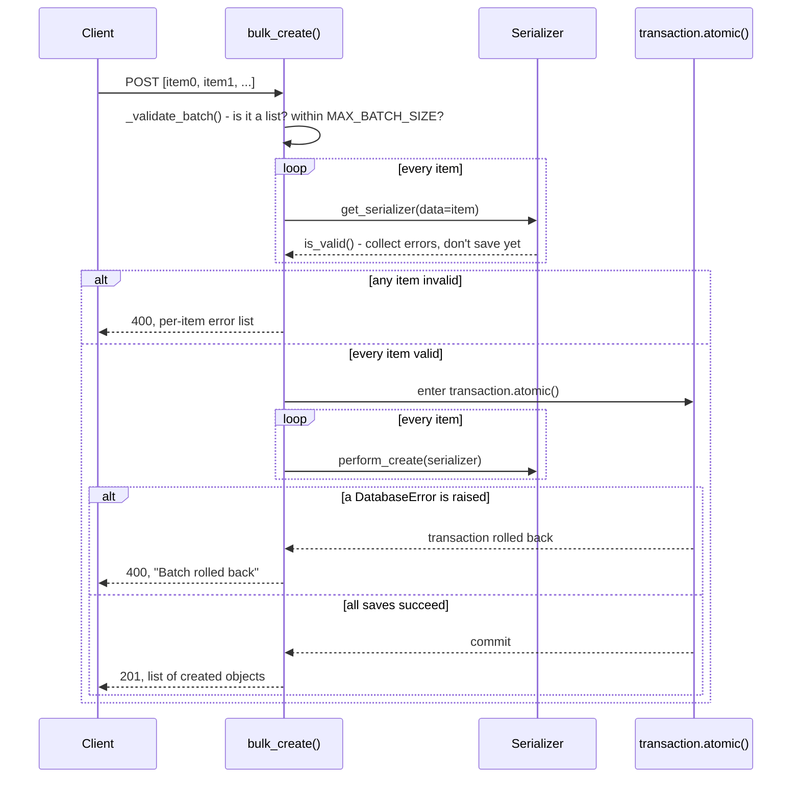

# Architecture

## Request pipeline (bulk_create, atomic mode)



## Module map

| Module | Responsibility |
| --- | --- |
| `mixins` | The four bulk action mixins - `bulk_create`/`bulk_update`/`bulk_partial_update`/`bulk_destroy` - and their atomic/non-atomic code paths. |
| `results` | `ItemResult` + `build_bulk_response` - the per-item response shape shared by every non-atomic code path. |
| `exceptions` | `NotAListError`, `BatchSizeExceededError`, `MissingLookupFieldError`, `ObjectNotFoundError`. |
| `settings` | The `BULK_OPERATIONS` setting (`MAX_BATCH_SIZE`, `ATOMIC`). |
| `viewsets` | `BulkModelViewSet` - all four mixins combined with DRF's `ModelViewSet`. |

## Why every bulk action has its own dedicated URL

This is the single most important, least obvious design constraint in
this package, discovered by testing DRF's router directly rather than
assuming it would "just work": DRF's `SimpleRouter.get_routes()`
creates **one URL `Route` per `@action`-decorated method**, keyed only
by that action's `url_path` - it does **not** merge multiple,
independently-decorated actions that happen to share a `url_path` into
one route with a combined method mapping. That merging only happens
via `@some_action.mapping.put`/`.patch`/`.delete` decorator chaining
*on the same function object*, which DRF's own docs show being done
once, in a single concrete view.

Concretely, giving `bulk_create` (`POST`) and `bulk_update` (`PUT`)
both `url_path="bulk"` produces two Django URL patterns with the
**identical path string** `^articles/bulk/$`, bound to two *different*
action maps (`{"post": "bulk_create"}` and `{"put": "bulk_update"}`).
Django's URL resolver matches the **first** pattern whose regex matches
the path - it does not consider HTTP method during URL resolution at
all - so a `PUT` request to `/articles/bulk/` would match the
first-registered pattern, find `"put"` missing from *that* pattern's
action map, and return `405 Method Not Allowed`, never reaching
`bulk_update`. This was confirmed empirically:

```python
>>> for u in router.urls:
...     print(u.pattern, '->', u.callback.actions)
^foos/bulk/$ -> {'post': 'bulk_create'}
^foos/bulk/$ -> {'put': 'bulk_update'}   # unreachable - shadowed by the pattern above
```

The `@mapping` chaining fix requires all verbs to be registered from a
single shared function object, which is fundamentally incompatible with
this package's actual goal: letting a project mix in *any subset* of
`BulkCreateModelMixin`/`BulkUpdateModelMixin`/
`BulkPartialUpdateModelMixin`/`BulkDestroyModelMixin` independently,
with zero coordination required between them. The robust fix, and the
one this package uses, is giving every one of the four actions a
genuinely distinct `url_path` (`bulk`, `bulk-update`,
`bulk-partial-update`, `bulk-delete`) - safe under any combination of
mixins, with no shared mutable state and no import-order sensitivity.
`tests/test_viewsets.py`'s `TestRoutingHasNoCollisions` asserts this
property directly against a real `DefaultRouter`, so a future change
that reintroduces a shared `url_path` fails loudly in CI rather than
silently shadowing a route.

## Atomic mode: validate everything, then write everything

`_bulk_create_atomic`/`_bulk_update_atomic`/`_bulk_destroy_atomic` all
follow the same two-phase shape:

1. **Validation phase** (no database writes): build a serializer per
   item (or resolve its target instance, for update/destroy) and
   collect every item's validation result. If *any* item is invalid,
   return `400` immediately with the full per-item error list - not
   even the valid items are saved.
2. **Write phase** (only reached if every item validated): enter one
   `transaction.atomic()` block and save every item. If a
   `django.db.DatabaseError` is raised partway through (a real
   database-level failure that validation couldn't have caught - e.g.
   a `UNIQUE` constraint violated by two items in the *same* batch,
   neither of which conflicts with anything already in the database),
   the whole transaction rolls back and the response is `400` naming
   the failure - nothing from this batch is left committed.

## Non-atomic mode: every item is its own unit of work

`_bulk_create_non_atomic`/`_bulk_update_non_atomic`/
`_bulk_destroy_non_atomic` process items strictly in order, one at a
time, each wrapped in its *own* `transaction.atomic()` savepoint. This
matters even though items are meant to be independent: after a
database-level error, Django's connection is left in a state where it
must roll back before any further queries can run on it - wrapping each
item's save in its own `transaction.atomic()` block means a failed
item's rollback is scoped to just that item, letting subsequent items
in the same request still run normally on the same connection.

The response is always the structured per-item list from
`results.build_bulk_response()`:

- Every item succeeded → the mixin's normal success status (`201` for
  create, `200` for update, `204` for destroy), with either a plain
  list of item data or (for destroy) no body at all.
- Some but not all succeeded → `207 Multi-Status`, with each item
  tagged `"status": "success"` or `"status": "error"`.
- Every item failed → `400`, using the same per-item shape as `207`.

## Why a within-batch duplicate title behaves differently in each mode

This is a real, useful illustration of the difference between the two
modes, not just a hypothetical: submitting two items with the same
unique `title` in one request, where neither title already exists in
the database:

- **Atomic mode**: both items pass their own `UniqueValidator` check
  during the validation phase (neither conflicts with anything
  currently committed). The write phase then tries to save both within
  the same transaction - the second insert genuinely violates the
  `UNIQUE` constraint against the first (uncommitted, but visible
  within the same transaction), raising a real `IntegrityError`. Caught
  as a `DatabaseError`, the whole transaction rolls back.
- **Non-atomic mode**: the first item is validated, saved, and
  *committed* (via its own savepoint) before the second item is even
  validated - so the second item's `UniqueValidator` now sees the
  first item's title as an existing, committed row, and correctly
  rejects it as an ordinary validation error, not a database error.

Both outcomes are correct for their respective mode's contract; see
`tests/test_bulk_create.py` for both scenarios verified against a real
SQLite database, not mocked.

## Object-level permission denial is a hard abort, not a per-item result

`bulk_update`/`bulk_partial_update`/`bulk_destroy` call
`self.check_object_permissions(request, instance)` for every resolved
instance, exactly like DRF's own single-object `update`/`destroy`
actions. A denial raises `PermissionDenied`, which propagates out of
the mixin method entirely - DRF's `dispatch()` catches it and converts
it to a plain `403` response *before* any items are processed,
regardless of atomic/non-atomic mode. This is deliberate: object-level
authorization is not a "some items succeed" concern, it's the same
all-or-nothing gate a single-object endpoint already has.
