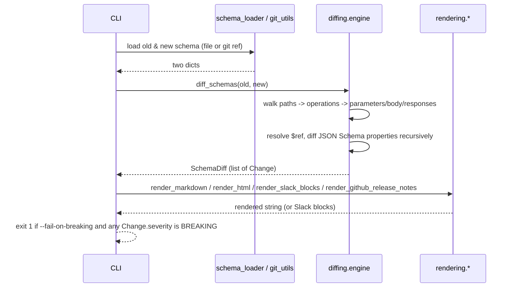

# Architecture

## Pipeline

## Module map

| Module | Responsibility |
| --- | --- |
| `changes` | `Change`, `ChangeKind`, `Severity`, `SchemaDiff` - the core data model. |
| `schema_loader` | Parses schema text (JSON or YAML) from any source. |
| `git_utils` | Reads a file's content at a Git ref via `git show`, no checkout. |
| `diffing.refs` | Resolves `$ref` / dereferences schema objects. |
| `diffing.engine` | The structural diff: paths, operations, parameters, bodies, responses. |
| `rendering.common` | Shared change partitioning (`summarize()`) used by every renderer. |
| `rendering.markdown` / `.html` / `.slack` / `.github` | The four output formats. |
| `cli` | The `drf-changelog-generator` console script. |
| `management.commands.generate_changelog` | Optional Django wrapper using `drf-spectacular`. |

## The breaking-change rule set

A change is **breaking** if and only if a client correctly following the
*old* contract could stop working against the *new* one, with no change
on its part:

| Change | Severity | Why |
| --- | --- | --- |
| Endpoint (path+method) removed | Breaking | The client's request now 404s/405s. |
| Endpoint added | Non-breaking | No existing client calls a new endpoint. |
| Endpoint newly deprecated/undeprecated | Non-breaking | `deprecated: true` is a signal, not a behavior change. |
| Required parameter/request field added | Breaking | Existing requests, unchanged, now fail validation. |
| Optional parameter/request field added | Non-breaking | Existing requests are unaffected. |
| Parameter/request field removed | Breaking | A client that always sends it may be rejected or silently ignored, either a behavior change. |
| Parameter/field required -> optional | Non-breaking | A superset of previously-valid requests is now accepted. |
| Parameter/field optional -> required | Breaking | Previously-valid requests may now be rejected. |
| Request or response field type changed | Breaking | The old type is inherently incompatible with the new one. |
| Response field added | Non-breaking | A client reading known fields is unaffected by an extra one. |
| Response field removed | Breaking | A client reading that field now gets `None`/`KeyError`. |
| Response status code added | Non-breaking | A client not handling it keeps its existing default behavior. |
| Response status code removed | Breaking | A client specifically handling that status code no longer sees it. |

This table is exhaustive - every `ChangeKind` maps to exactly one row.
See `src/drf_changelog_generator/diffing/engine.py` for the
implementation; there is no additional hidden heuristic.

## Design decisions

### Git access via `git show`, never a checkout

Checking out a historical ref would mutate the working tree the tool is
invoked from (disruptive if run inside an active development
environment or CI checkout) and requires the *entire* project's
dependencies to be installable at that historical commit just to read
one file. `git show <ref>:<path>` reads a single file's blob directly
from Git's object database - fast, side-effect-free, and only requires
the schema file to have been committed, not the whole project to be
runnable at that ref.

### Four renderers share one partitioning function

`rendering.common.summarize()` is the single source of truth for how a
diff's changes map onto "Added Endpoints" / "Removed Endpoints" /
"Deprecated Endpoints" / "Breaking Changes" / "Non-Breaking Changes".
Every renderer calls it rather than re-implementing the same
partitioning logic four times, so the four output formats can never
drift out of sync on what counts as what.

### The CLI has no Django dependency in its execution path

Although this package declares Django/DRF as dependencies (for the
optional management command and workspace-wide consistency), `cli.py`
itself never imports Django. A CI job or GitHub Action can install this
package and run `drf-changelog-generator diff ...` against two schema
files with zero Django project in sight.
