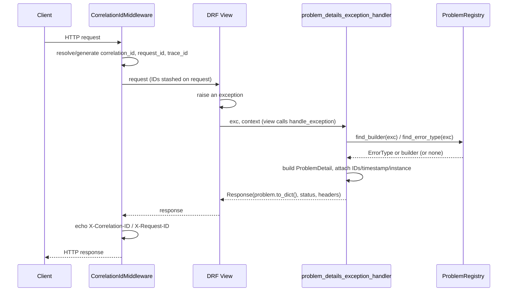

# Architecture

## Request lifecycle

## Module map

| Module | Responsibility |
| --- | --- |
| `problem` | The `ProblemDetail` value object and its `to_dict()`/`with_extensions()`. |
| `codes` | `ErrorType` and the built-in error type definitions. |
| `registry` | `ProblemRegistry`: exception class -> `ErrorType` or custom builder, resolved via MRO. |
| `normalize` | Flattens nested DRF `ValidationError.detail` into `NormalizedError` entries. |
| `handler` | `problem_details_exception_handler`: orchestrates everything above into a `Response`. |
| `middleware` | `CorrelationIdMiddleware` and its typed accessor functions. |
| `exceptions` | `ProblemAPIException` and ready-made `ConflictError` / `UnprocessableEntityError`. |
| `localization` | Thin wrapper over Django's i18n machinery, request-scoped. |
| `catalog` | Introspects a registry into a sorted, renderable error catalog. |
| `openapi` | `drf-spectacular` postprocessing hook and the `ProblemDetail` schema. |
| `compat` | Converts a `ProblemDetail` into the `drf-standardized-errors` shape. |
| `settings` | The `ERROR_RESPONSE_STANDARDIZER` setting: validation, defaults, cache invalidation. |

## Design decisions

### Why a registry instead of a fixed if/elif chain?

A fixed chain of `isinstance` checks (which is what DRF's own default
handler is) cannot be extended without monkey-patching. The registry
lets any application register a mapping for its own exception classes in
one line, resolved by the same MRO-walking strategy DRF uses internally
for `APIException` subclasses - more specific registrations always win
over base-class ones.

### Why `ProblemDetail` is a frozen dataclass

Problem construction happens in several stages (build from the
exception, attach request-scoped extensions, optionally merge
compatibility extensions) that each need to add information without
mutating a shared object different call sites might still be holding a
reference to. `with_extensions()` returns a new instance, which also
makes the whole pipeline trivially testable in isolation - see
`tests/test_handler.py`.

### Why nested errors use JSON-Pointer-style paths, not dotted paths

RFC 9457's own worked example (Appendix A.3) uses a `pointer`
field for extension-member validation errors. Slash-separated paths also
compose naturally with array indices (`tags/0`) without ambiguity with
field names that happen to contain dots. `compat.py` converts to
dot-separated `attr` paths only when emitting the
`drf-standardized-errors`-compatible shape, which uses that convention.

### Why headers and rollback are handled explicitly

DRF's own default `exception_handler` sets `WWW-Authenticate` (from
`exc.auth_header`, itself set by `APIView.handle_exception` before any
configured handler runs), `Retry-After` (from `exc.wait` on
`Throttled`), and calls `set_rollback()` so `ATOMIC_REQUESTS` rolls back
correctly even though the exception is swallowed into a normal
`Response`. A replacement handler that skips these silently breaks
authentication challenges, rate-limit client behavior, and transactional
consistency - this package replicates all three exactly.
