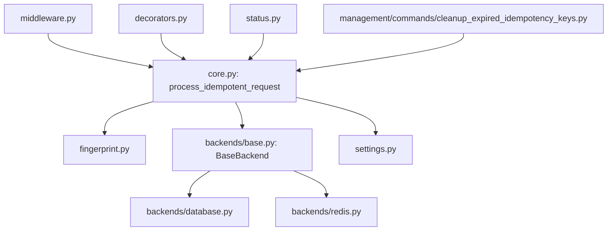
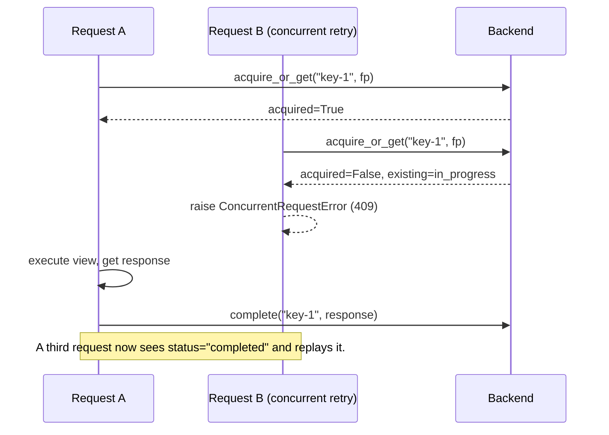

# Architecture

## Module map

- **`core.py`** — `process_idempotent_request`, the single function both
  the middleware and the decorator delegate to. Everything about
  acquire-or-replay semantics lives here, exactly once.
- **`fingerprint.py`** — a pure function hashing method + path + body.
- **`backends/base.py`** — the `BaseBackend` interface and the
  `AcquireResult`/`StoredRecord` data model every backend speaks in.
- **`backends/database.py`** / **`backends/redis.py`** — the two
  built-in backends.
- **`middleware.py`** — project-wide integration; also responsible for
  converting this package's exceptions into JSON responses, since plain
  Django middleware has no equivalent of DRF's exception handling.
- **`decorators.py`** — per-view integration; raises the same exceptions
  directly, letting DRF's own `APIView.dispatch()` convert them (since
  they subclass `APIException`).
- **`status.py`** — the small status-tracking query function.

## The core operation: acquire-or-get

Every backend implements one atomicity-critical method:
`acquire_or_get(key, fingerprint, lock_ttl) -> AcquireResult`. Given two
concurrent callers with the same key, exactly one must receive
`acquired=True` (and should proceed to execute the view) — the other(s)
receive `acquired=False` plus the current stored record.

### How each backend achieves atomicity

- **`RedisBackend`**: a single `SET key value NX EX ttl` command. Redis
  guarantees this is atomic across all clients — no separate locking
  library needed.
- **`DatabaseBackend`**: `IdempotencyRecord.objects.get_or_create(key=key,
  defaults={...})` inside `transaction.atomic()`. The `key` column has a
  `unique=True` constraint; Django's `get_or_create` already handles the
  race this creates (catching the `IntegrityError` a concurrent insert
  would raise, and re-fetching) — no database-specific locking primitive
  (`SELECT ... FOR UPDATE`, advisory locks, ...) is required, which is why
  this backend works identically on PostgreSQL, MySQL, and SQLite.

## Why fingerprinting matters

Without fingerprinting, a key is just a lock — nothing stops a client
bug (or malicious client) from sending `Idempotency-Key: X` with one
request body, then reusing `X` with a *different* body, silently getting
the first response replayed against the second, semantically different,
operation. `compute_fingerprint()` hashes method + path + body; a
mismatch between the fingerprint stored with a key and the fingerprint of
the current request raises `IdempotencyKeyReuseError` (`422`) rather than
ever replaying a response against the wrong request.

## Re-entrancy guard

DRF/Django's request pipeline is layered: middleware wraps everything,
including any view-level decorator. If a project has
`IdempotencyMiddleware` installed *and* a view also carries `@idempotent()`,
both would — naively — try to run the full acquire-or-replay logic for
the same request. The outer (middleware) call would acquire the lock
first; the inner (decorator) call would then see that same key as
"already in progress" (mistaking its own outer call for a genuine
concurrent request) and raise a spurious `409`.

`process_idempotent_request` guards against this with a simple marker:
the first call sets `request._drf_idempotency_handled = True`; any nested
call on the *same request object* sees the marker and just executes
`call_view()` directly, skipping its own acquire-or-replay logic entirely.
This is what makes combining both integration points safe (even though
using just one is clearer — see
[Advanced Usage](advanced-usage.md#combining-the-decorator-with-global-middleware)).

## Why view exceptions behave differently under middleware vs. the decorator

This is subtle enough to be worth writing down. Django wraps every
middleware's `get_response` in `convert_exception_to_response` *before*
handing it to the next (outer) middleware. That means by the time
`IdempotencyMiddleware.__call__` calls `self.get_response(request)`, any
exception raised by the view (or any inner middleware) has *already* been
converted into an HTTP response (typically `500`) — it never reaches
`process_idempotent_request`'s own `try/except Exception` as a raised
exception. Instead, `_finalize()`'s status-code check
(`response.status_code < 500`) is what correctly identifies it as
uncacheable and releases the lock via `backend.fail()`.

For the `@idempotent()` decorator, there is no such wrapping between the
decorator and the raw view function it wraps — an exception raised inside
the view propagates directly through the decorator's own
`try/except Exception`, hitting `backend.fail()` and re-raising, *before*
DRF's `APIView.dispatch()` gets a chance to convert it. Both paths reach
the same outcome (the lock is released so a retry can proceed for real),
just via different code paths — see
`tests/test_core.py::TestProcessIdempotentRequestDirectly` for a direct,
unit-level test of the exception path, and
`tests/test_integration.py::TestFailureHandling`/`TestDecorator` for both
integration paths exercised end-to-end.

## Design principles

- **One atomic primitive per backend.** Everything else — replay,
  fingerprinting, header handling — is backend-agnostic logic in
  `core.py`.
- **Correctness under concurrency is the point.** The test suite includes
  genuine multi-threaded races (`tests/test_concurrency.py`), not just
  sequential simulations, for the atomicity guarantee itself.
- **Small public API.** One middleware, one decorator, one status
  function, one backend interface.
