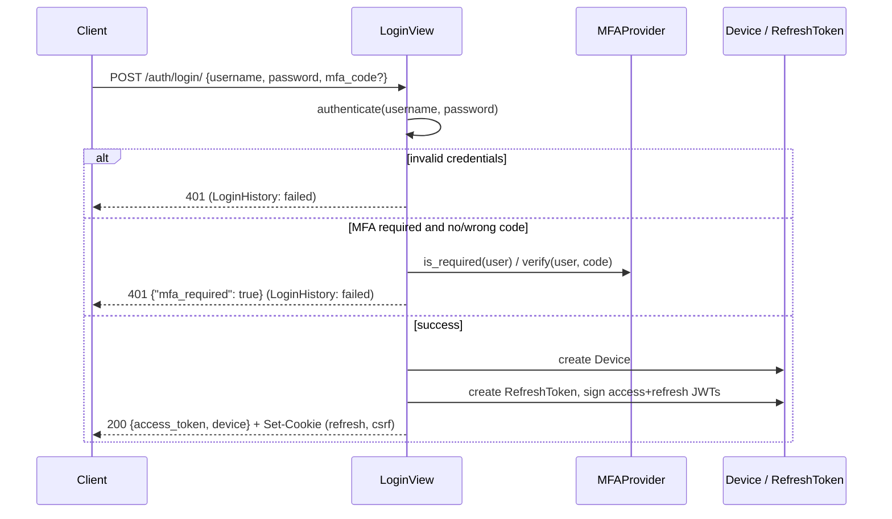
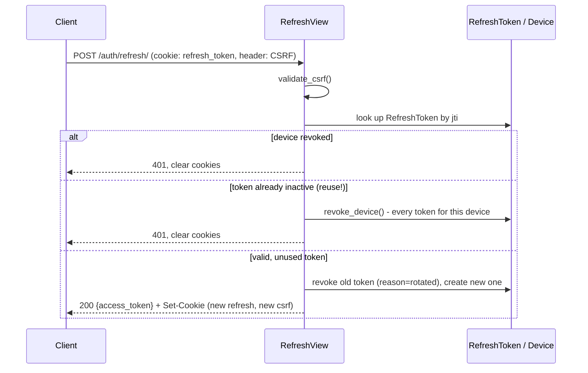

# Architecture

## Login flow

## Refresh (rotation + reuse detection)

## Module map

| Module | Responsibility |
| --- | --- |
| `tokens` | Pure JWT encode/decode (no database dependency). |
| `models` | `Device` (session), `RefreshToken`, `LoginHistory`, `TOTPDevice`. |
| `devices` | Device (session) lifecycle: create, touch, revoke, revoke-all. |
| `rotation` | Issues and rotates token pairs; reuse detection lives here. |
| `cookies` | Sets/clears the httpOnly refresh cookie and the CSRF cookie. |
| `csrf` | Double-submit-cookie CSRF validation for cookie-authenticated endpoints. |
| `authentication` | `JWTAuthentication`, the DRF authentication class for access tokens. |
| `mfa` | `MFAProvider` interface and the built-in RFC 6238 `TOTPProvider`. |
| `serializers` / `views` / `urls` | The login/refresh/logout/device/MFA API. |
| `admin` | Django admin registration for every model. |
| `settings` | The `JWT_AUTH_KIT` setting: validation, defaults, cache invalidation. |

## Design decisions

### A `Device` is both a "device" and a "session"

Rather than two overlapping models, one `Device` row is created per
login and reused across every refresh (only the `RefreshToken` rotates).
"Device management" and "session management" are the same feature in
practice - this mirrors how GitHub, Google, and most other providers
present a single "where you're signed in" list.

### Stateless access tokens, by design

`JWTAuthentication` verifies an access token's signature and expiry
without a database query, by default. This is the whole point of using
JWTs: an API server can authenticate a request without a network hop to
a session store. The trade-off is that revoking a device (logout-all,
device revocation) does not invalidate an already-issued access token
until it naturally expires - which is why `ACCESS_TOKEN_LIFETIME`
defaults to a short 5 minutes. Projects that need immediate revocation
at the cost of statelessness can opt into
`CHECK_DEVICE_REVOCATION_ON_AUTH`.

### Reuse detection revokes the whole device, not just the reused token

When a refresh token that was already rotated away gets presented again,
there is no way to tell which of the two parties holding a copy (the
legitimate client, or an attacker with a stolen copy) is making this
particular request. The only safe response is to revoke every token for
that device - forcing a fresh login - rather than guessing. This is the
same design OAuth2 refresh token rotation (RFC 6819 §5.2.2.3) recommends.

### The refresh token lives in a cookie; the access token does not

An httpOnly cookie is the only storage JavaScript cannot read, which is
what makes a stolen refresh token via XSS meaningfully harder than
`localStorage`. The access token, by contrast, is deliberately handed to
the client to hold in memory and attach to the `Authorization` header -
it is short-lived enough that a leak has a small blast radius, and
putting it in a cookie too would mean *every* request (not just
`/auth/*`) needs CSRF protection instead of just the handful of
cookie-authenticated endpoints.

### CSRF is double-submit-cookie, not Django's built-in CSRF middleware

Django's CSRF middleware is designed around session-authenticated,
server-rendered views. This package's refresh/logout endpoints are
typically hit by a separate SPA/mobile client that may not run Django's
`CsrfViewMiddleware` at all in front of the API. A dedicated,
self-contained double-submit-cookie check keeps this package usable
without requiring a specific Django CSRF middleware configuration.
