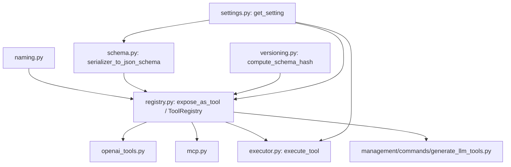
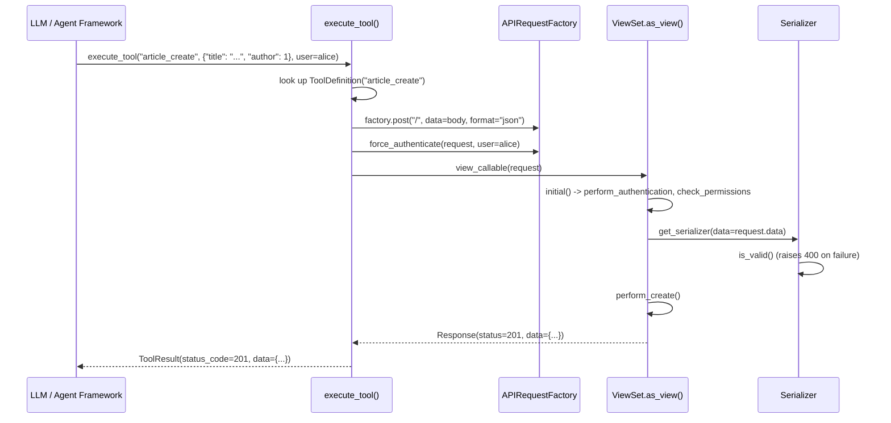

# Architecture

## Module map

- **`naming.py`** — pure string transformation (CamelCase viewset class
  name -> snake_case tool base name). No Django/DRF imports.
- **`schema.py`** — the JSON Schema converter. Given a serializer class or
  instance, walks its fields (recursing into nested serializers) and
  produces a JSON-Schema-compatible `dict`. No knowledge of viewsets,
  tools, or HTTP at all — pure serializer introspection.
- **`registry.py`** — `ToolDefinition` (a frozen dataclass holding
  references to a viewset/serializer *class*, not a frozen schema) and
  `ToolRegistry` (a name -> `ToolDefinition` map). `expose_as_tool` is the
  class decorator that builds and registers one `ToolDefinition` per
  requested action.
- **`versioning.py`** — a stable content hash over a generated schema.
- **`openai_tools.py` / `mcp.py`** — thin, format-specific wrappers around
  `ToolDefinition.input_json_schema()`. Neither does any schema generation
  itself.
- **`executor.py`** — `execute_tool()`, the runtime dispatcher. Translates
  a tool call into a real DRF request via `APIRequestFactory` +
  `.as_view()`, so authentication/permissions/validation all run for
  real.
- **`management/commands/generate_llm_tools.py`** — CLI wrapper around
  `to_openai_tools` / `to_mcp_tools` / raw schema export.

## Why schemas aren't frozen at registration time

`ToolDefinition` stores `viewset_class` and `serializer_class` as class
references. `input_json_schema()` calls `serializer_to_json_schema()`
fresh every time it's invoked — it re-instantiates the serializer and
re-walks its (potentially just-edited) fields. This is a deliberate
design choice: **there is no "sync" step**. If you edit a serializer field
and reload your Django process, the very next `generate_llm_tools` run (or
`to_openai_tools()` call) reflects the change automatically, and
`schema_hash` changes too — see
`tests/test_registry.py::TestExposeAsTool::test_schema_hash_reflects_live_serializer_changes`
for this asserted directly.

## Request lifecycle: `execute_tool`

Nothing about DRF's dispatch, authentication, or validation is
reimplemented — `execute_tool` builds a synthetic request with
`rest_framework.test.APIRequestFactory` (the same tool DRF's own test
suite and `APIClient` are built on) and calls the viewset's real
`.as_view()` callable. This is what makes tool execution behaviorally
identical to a real HTTP call, not a parallel, potentially-divergent code
path.

## Why `execute_tool` raises instead of returning error responses

A raw HTTP response's status code is the natural way to signal errors over
the wire, but a Python function-calling convention is Pythonic exceptions.
`execute_tool` translates `401`/`403` into `ToolPermissionDeniedError` and
`400` into `ToolValidationError`, so calling code can `try`/`except`
around tool execution the way it would around any other Python API. Other
status codes (`404`, `2xx`) pass through unchanged in the returned
`ToolResult`, since those aren't "errors in calling the tool" so much as
"the tool ran and told you something" (an agent might reasonably want to
see a 404 and decide what to do next, rather than have it raised).

## Design principles

- **Derive, never duplicate.** Schemas come from the live serializer, not
  a hand-maintained copy.
- **Real dispatch, not reimplementation.** `execute_tool` uses DRF's own
  `.as_view()` machinery rather than re-deriving authentication/permission
  logic.
- **Explicit registration.** Nothing is exposed as a tool unless named
  explicitly in `@expose_as_tool(actions=[...])` — no implicit
  "everything is a tool" mode.
- **Small public API.** One decorator, two exporters, one executor, one
  schema function — see [API Reference](api-reference.md).
