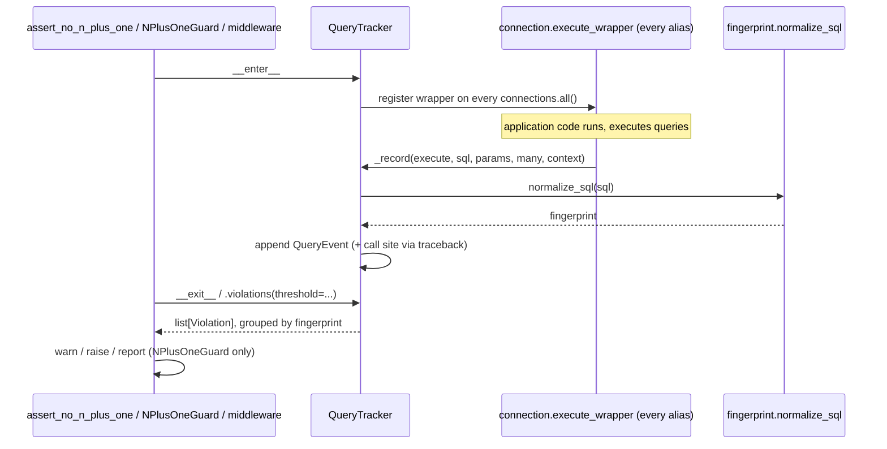

# Architecture

## Pipeline

## Module map

| Module | Responsibility |
| --- | --- |
| `fingerprint` | Normalizes SQL text into a comparable fingerprint. |
| `tracker` | `QueryTracker`: pure query capture via `connection.execute_wrapper()`; `QueryEvent`/`Violation` data model. |
| `guard` | `NPlusOneGuard`: wraps `QueryTracker` with settings-aware warn/raise/report dispatch. |
| `middleware` | `NPlusOneGuardMiddleware`: one `NPlusOneGuard` per request, plus a `DEBUG`-only response header. |
| `decorators` | `guard_view()`: one `NPlusOneGuard` per decorated method call. |
| `testing` | `assert_no_n_plus_one()`: a settings-independent assertion context manager for tests. |
| `settings` | The `N_PLUS_ONE_GUARD` setting, validated and cache-invalidating. |
| `exceptions` | `NPlusOneGuardError`, `NPlusOneDetectedError`. |

## Why fingerprinting, not a query-count budget

A test asserting "at most N queries" breaks the moment you add any
unrelated, legitimate query, has to be manually re-tuned every time
that happens, and - when it does fail - tells you nothing about *which*
query grew, only that the total did. Fingerprinting instead asks "did
any *specific query shape* repeat" - the actual signature of an N+1
(one query per row of an un-prefetched loop) - and reports exactly
which shape, how many times, and where. Adding an unrelated query
elsewhere in the same request never affects this.

## Why no literal-stripping is needed

Django's ORM always executes parameterized queries: the `sql` string a
database backend receives already has placeholders (`%s`, `?`, or
`%(name)s` depending on the backend) in place of literal values, with
the actual values passed separately as `params`. Two executions of an
N+1-shaped query - once per row, each with a different foreign key
value - therefore already produce **byte-identical** `sql` text before
this package ever sees it. `fingerprint.normalize_sql()` only collapses
incidental whitespace differences; it does not need to (and does not)
strip literal numbers or quoted strings, unlike tools built for
non-parameterized query logs.

## Capturing queries: `connection.execute_wrapper()`, not `DEBUG`/monkeypatching

`QueryTracker` uses Django's own public instrumentation hook,
`connection.execute_wrapper()` (stable API since Django 3.0), registered
on every alias in `connections.all()` for the duration of the guarded
scope. This is deliberately **not**:

- Reading `connection.queries`, which only populates when
  `settings.DEBUG` is `True` (or `django.test.utils.CaptureQueriesContext`
  is used) - this package works identically regardless of `DEBUG`.
- Monkeypatching `CursorWrapper.execute`/`executemany` - `execute_wrapper`
  is Django's own supported extension point for exactly this purpose,
  so this package has no dependency on Django's private internals.

## Identifying the call site

At the moment each query executes, `tracker._first_application_frame()`
walks `traceback.extract_stack()` from the innermost frame outward,
skipping any frame whose file path is under this package's own source
directory or a recognized library path (`/site-packages/`, `/django/`,
`/rest_framework/`) - a heuristic, not a guarantee, documented as such.
The first frame that survives this filter is reported as the call site
(`"<filename>:<lineno>"`). This is why the reported location is your
serializer's `get_author_name`, not `django/db/models/query.py` or this
package's own `tracker.py`.

## `NPlusOneGuard` vs. `QueryTracker`

`QueryTracker` is deliberately dumb: it captures events and groups them
into violations given an explicit threshold - it never logs, raises, or
reads a Django setting. `NPlusOneGuard` is the settings-aware layer on
top: it reads `THRESHOLD`/`MODE`/`IGNORE_PATTERNS` (with per-call
overrides) and dispatches - log a warning, raise, or do nothing and let
you read `.violations`. `NPlusOneGuardMiddleware` and `guard_view()` are
both thin wrappers around `NPlusOneGuard`; `assert_no_n_plus_one()`
wraps `QueryTracker` directly instead, bypassing settings entirely (see
[Configuration](configuration.md#why-assert_no_n_plus_one-ignores-n_plus_one_guard)).

## A real exception from the guarded code is never masked

If the code inside a `with NPlusOneGuard(...)`/`assert_no_n_plus_one()`
block raises, that exception propagates as-is - the guard's `__exit__`
checks `exc_type is not None` and skips its own dispatch entirely in
that case, even if a violation was also found. A test failing for its
own real reason should never show a confusing, unrelated "suspected
N+1" message instead of (or in addition to) the actual failure.
