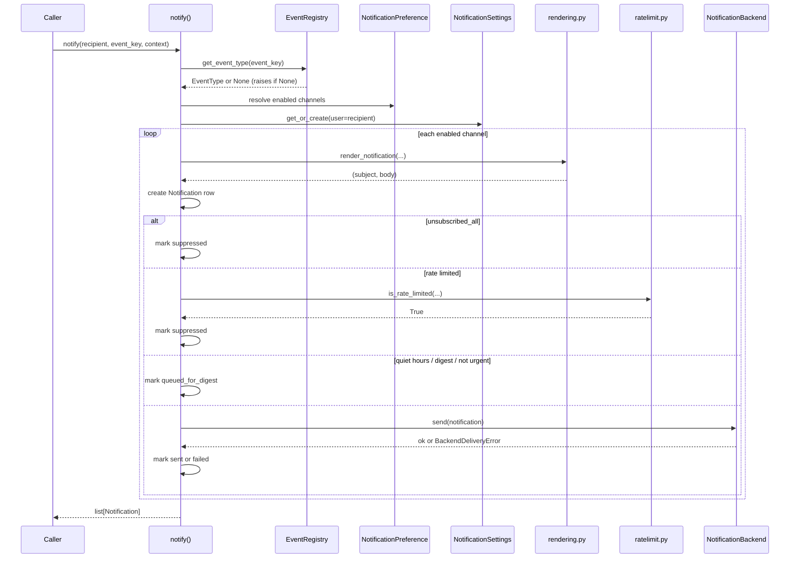

# Architecture

## The `notify()` pipeline

## Module map

| Module | Responsibility |
| --- | --- |
| `events` | `EventType` / `EventRegistry`: the code-level catalog of notification kinds. |
| `models` | `NotificationSettings`, `NotificationPreference`, `WebhookTarget`, `NotificationTemplate`, `Notification`. |
| `rendering` | Resolves a template (database or fallback) and renders subject/body. |
| `quiet_hours` | Timezone-aware, wraparound-safe quiet-hours evaluation. |
| `ratelimit` | Cache-backed fixed-window rate limiting. |
| `unsubscribe` | Signed, stateless single-event/global unsubscribe tokens. |
| `url_safety` | Best-effort SSRF guard for user-submitted webhook URLs. |
| `backends.*` | The `NotificationBackend` interface and the five built-in backends. |
| `notify` / `async_notify` | The orchestrator (`notify`) and its async wrapper (`anotify`). |
| `digest` | Batches queued notifications into one delivery per user per channel. |
| `tasks` | Optional Celery task for asynchronous delivery with retry/backoff. |
| `serializers` / `views` / `urls` | The preference-center DRF API. |
| `admin` | Django admin registration for every model. |
| `settings` | The `NOTIFICATIONS` setting: validation, defaults, cache invalidation. |

## Design decisions

### Event types are code, preferences are data

An `EventType` (key, description, default channels, urgency) never
changes per-request and has no meaningful per-tenant variation - it
describes what the *software* can send. A `NotificationPreference`
(does *this user* want *this event* on *this channel*) is exactly the
kind of small, frequently-read, occasionally-written state a database
row is for. Mixing the two (e.g. storing event *definitions* in the
database) would require an admin UI and migration story for something
that's really a code change; this package deliberately mirrors the
`ProblemRegistry` pattern from `drf-error-response-standardizer` here.

### Every channel produces a `Notification` row, even suppressed ones

`notify()` always creates a row per attempted channel - including
channels that end up suppressed by a rate limit or a global unsubscribe
- rather than silently skipping them. This makes "why didn't this user
get an email" answerable by reading `Notification.status` and
`last_error`, instead of needing to reconstruct the decision from
scattered logs.

### In-app notifications are never deferred

Quiet hours and digesting exist to protect a user from being
interrupted (an email ping, a push buzz) at a bad time. An in-app
notification is passive - it just sits in a list until the user opens
the app - so there is no interruption to protect against, and deferring
it would only make the in-app inbox feel stale.

### The webhook backend uses `urllib`, not `requests`

Adding `requests` as a hard dependency for one optional channel would
be a heavier dependency footprint than this package's design otherwise
needs (every other backend either uses Django itself or is a stub). The
standard library's `urllib.request` is entirely sufficient for a
single signed POST with a timeout.
