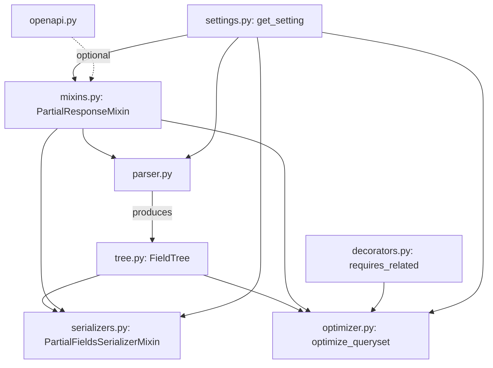
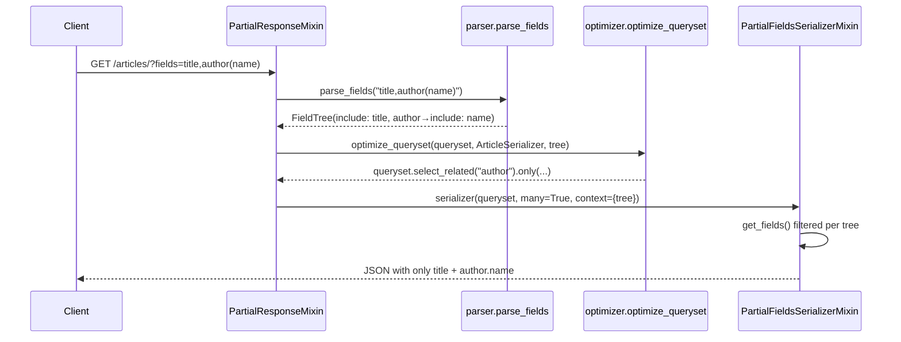
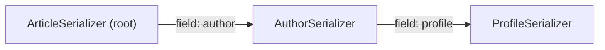
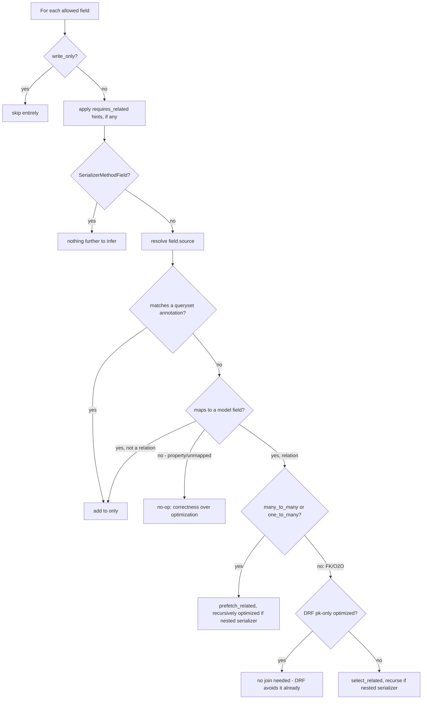

# Architecture

## Module map

- **`parser.py`** — a hand-written recursive-descent parser with zero
  runtime dependencies beyond the standard library. Converts the raw
  `fields` query string into a `FieldTree`.
- **`tree.py`** — the framework-agnostic data model (`FieldTree`,
  `FieldSpec`) plus `resolve_allowed_names()` and `child_tree()`, the two
  pure functions both the serializer mixin and the optimizer build on.
  Nothing here imports Django or DRF.
- **`serializers.py`** — `PartialFieldsSerializerMixin`, which filters
  `get_fields()` and renames aliased keys in `to_representation()`.
- **`optimizer.py`** — `optimize_queryset()`, which walks a serializer
  class and a `FieldTree` in lockstep with Django's model metadata to build
  `select_related` / `prefetch_related` / `only()` calls.
- **`mixins.py`** — `PartialResponseMixin`, the view-level glue: parses the
  request once per view instance, injects the tree into the serializer
  context, and calls the optimizer.
- **`decorators.py`** — `requires_related`, the escape hatch for
  optimizing `SerializerMethodField`.
- **`settings.py`** — the lazy, validated, cache-invalidating settings
  object, modeled on DRF's own `api_settings`.
- **`openapi.py`** — optional, isolated drf-spectacular integration.

## Request lifecycle

## Why filtering happens in `get_fields()`, not `to_representation()`

The naive approach — call the normal serializer, then strip unwanted keys
from the output dict — is simple but wastes exactly the work this package
exists to avoid: every `SerializerMethodField` still runs, every nested
serializer still fully renders, and the queryset still needs every column
and join regardless of what gets discarded afterward.

Instead, `PartialFieldsSerializerMixin.get_fields()` removes unrequested
fields from `self.fields` *before* `to_representation()` iterates over
them. DRF's `Serializer.to_representation()` only calls
`field.get_attribute()` / `field.to_representation()` for fields present in
`self.fields`, so a removed field's method is never invoked. This is also
why `optimize_queryset()` mirrors the *same* field-resolution logic
(`resolve_allowed_names()` from `tree.py`) rather than inspecting the
already-filtered serializer output — both sides need to agree on which
fields are "in" before either does its work.

## Resolving nesting: path-from-root

A nested serializer instance doesn't inherently know which branch of the
top-level `FieldTree` applies to it. `PartialFieldsSerializerMixin` solves
this by walking from itself up to the root serializer via the `.parent`
chain, collecting field names as it goes (skipping the empty `field_name`
that `ListSerializer` children have), then descending into the top-level
tree along that same path:

For `?fields=author(profile(display_name))`, the path from `ProfileSerializer`
to the root is `["author", "profile"]`. `_resolve_local_tree()` starts at
the top `FieldTree`, descends into `"author"`'s nested group, then into
`"profile"`'s nested group, arriving at `include: {display_name}` — exactly
the restriction that instance should apply to itself. The same path-walk
(via `child_tree()`) is reused by the optimizer to decide what to
`select_related` / `only()` at each nesting level, and to build the correct
nested queryset for `Prefetch`.

## The query optimizer's decision tree

See [`docs/performance.md`](performance.md) for the reasoning behind each
branch and measured results.

## Design principles

- **Correctness over optimization.** Any field the optimizer can't map
  confidently to a model column or relation is left alone rather than
  guessed at. See [Troubleshooting](troubleshooting.md) for the full list
  of cases this applies to.
- **No hidden dependencies.** The core package depends only on Django and
  DRF. drf-spectacular is entirely optional and isolated in one module.
- **Small, composable public API.** Two mixins, one decorator, one
  function-level escape hatch (`parse_request_fields` /
  `optimize_queryset`) for non-`GenericAPIView` usage. See
  [API Reference](api-reference.md).
