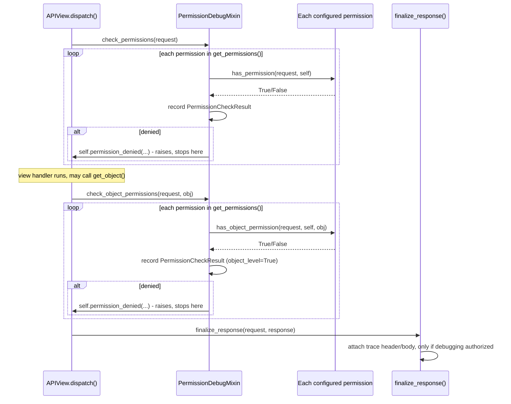

# Architecture

## Request pipeline



## Module map

| Module | Responsibility |
| --- | --- |
| `mixins` | `PermissionDebugMixin` - the recording overrides and the response-attachment logic. |
| `tracing` | `PermissionCheckResult`/`PermissionTrace` - the recorded data shape. |
| `introspection` | `describe_permissions`/`describe_view` - static, no-live-request inspection. |
| `settings` | The `PERMISSION_DEBUGGER` setting. |
| `management.commands.show_view_permissions` | A CLI wrapper around `introspection`. |

## The core guarantee: identical behavior to a plain `APIView`

This package's entire value proposition depends on one property holding
exactly: mixing in `PermissionDebugMixin` must never change whether a
request is granted or denied, in what order permissions are checked, or
which exception is raised. `check_permissions`/`check_object_permissions`
are therefore written to be *line-for-line* equivalent to DRF's own
`APIView` implementations, with recording inserted around (not instead
of) each call:

```python
# DRF's own APIView.check_permissions
def check_permissions(self, request):
    for permission in self.get_permissions():
        if not permission.has_permission(request, self):
            self.permission_denied(
                request,
                message=getattr(permission, 'message', None),
                code=getattr(permission, 'code', None)
            )
```

```python
# PermissionDebugMixin.check_permissions
def check_permissions(self, request):
    trace = get_permission_trace(self) or PermissionTrace()
    self._permission_trace = trace
    for permission in self.get_permissions():
        granted = permission.has_permission(request, self)
        self._record_check(trace, permission, granted, object_level=False)
        if not granted:
            self.permission_denied(
                request,
                message=getattr(permission, "message", None),
                code=getattr(permission, "code", None),
            )
```

Same iteration order over `self.get_permissions()`, same call to
`permission.has_permission(request, self)`, same early exit via
`self.permission_denied(...)` on the exact permission that denies -
the only addition is `self._record_check(...)` between the check and
the potential exit. `check_object_permissions` follows the identical
pattern for `has_object_permission`. This is verified directly in
`tests/test_integration.py`'s `TestBehaviorIsUnchanged` - same status
codes, same `detail` messages, as an equivalent view without the mixin.

## Why the trace accumulates across both request-level and object-level checks

`check_permissions()` and `check_object_permissions()` are two
*separate* DRF hooks, called at different points in a request's
lifecycle (`check_permissions` inside `initial()`, before the handler
runs at all; `check_object_permissions` only when - and if - the view
calls `get_object()`, which may be never, once, or in principle more
than once). Both write into the *same* `self._permission_trace`
(created lazily, reused if it already exists) rather than each starting
a fresh one - so by the time `finalize_response` runs, the trace
reflects everything checked during the *whole* request, not just the
last hook that ran. This is why the same permission class can appear
twice in one trace (once request-level, once object-level) - see
[Quick Start](quickstart.md) for a worked example.

## Why the response body is only mutated on a denial

`response.data["permission_trace"] = trace.as_dict()` only runs when
`not trace.all_granted` - a successful (granted) response never has its
body shape changed, even with `INCLUDE_IN_RESPONSE_BODY: True`. This
matters for client compatibility: a consumer parsing a `200`/`201`
response body against a fixed schema would break if an extra key
appeared unpredictably; a `403`'s body is already an error shape
(`{"detail": "..."}`) that clients generally don't validate as strictly.

## Why `finalize_response` (not middleware) attaches the header

Same reasoning as this workspace's other response-header packages:
`self._permission_trace` lives on the view instance itself, populated
during `check_permissions`/`check_object_permissions` - a Django
middleware operating on the plain `HttpRequest`/`HttpResponse` has no
access to that instance at all. `finalize_response` is the DRF-level
hook that runs with the view instance still in scope, right before the
response leaves the view layer.

## Why `describe_permissions()` doesn't fall back to an inherited docstring

`PermissionDescription.docstring` deliberately reads only a permission
class's *own* `__dict__["__doc__"]`, not the result of
`inspect.getdoc()` (which walks the MRO for an inherited docstring).
Since `rest_framework.permissions.BasePermission` itself has a generic
docstring ("A base class from which all permission classes should
inherit."), `inspect.getdoc()` on *any* undocumented custom permission
subclass would silently return that generic text instead of correctly
reporting "no docstring" - actively misleading for a tool whose purpose
is telling a developer what a permission class actually does.
