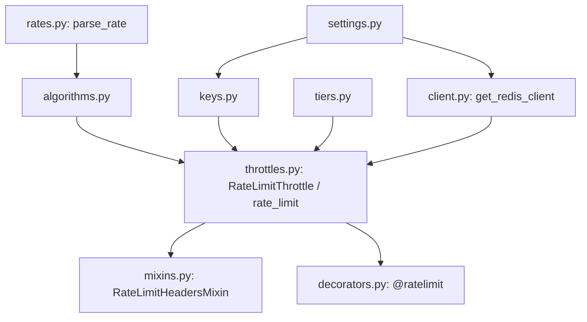
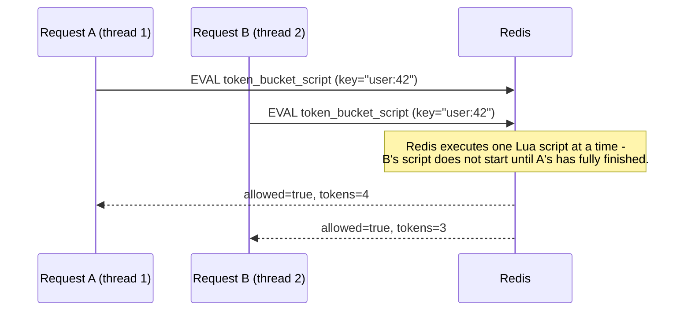

# Architecture

## Module map

- **`rates.py`** — parses `"100/m"`-style strings into a `Rate(count, period)`.
- **`algorithms.py`** — the three Lua-script-based algorithms. Pure
  functions: `(client, key, rate, cost, ...) -> LimitResult`. No DRF
  imports at all.
- **`keys.py`** — built-in and composable key functions, all sharing the
  `(request, view=None) -> str` signature.
- **`tiers.py`** — plan-tier rate resolution.
- **`client.py`** — resolves and caches the Redis client from settings.
- **`throttles.py`** — `RateLimitThrottle`, a real
  `rest_framework.throttling.BaseThrottle` subclass, and `rate_limit()`,
  the factory that configures one.
- **`mixins.py`** — `RateLimitHeadersMixin`, adding informational headers
  to every response.
- **`decorators.py`** — `@ratelimit()` for function-based views.

## Why atomicity is everything

Every algorithm here reduces to one `EVAL` call. Redis executes an entire
Lua script as a single atomic operation — no other command runs on that
Redis (or, in Cluster mode, that shard) in between reading the current
count/tokens and writing the updated value. This is what makes concurrent
requests with the same key impossible to double-count: there is no gap
between "check" and "increment" for a race to land in.

`tests/test_concurrency.py` proves this directly: many real OS threads
hammering the same key concurrently never collectively exceed the
configured limit, for all three algorithms.

## Redis Cluster compatibility

Redis Cluster shards keys across nodes by hashing the key (or the portion
inside `{}`, if present) to one of 16384 slots. A multi-key operation
(including a Lua script referencing multiple `KEYS[]`) is **only** allowed
if every key involved hashes to the same slot — otherwise Redis returns a
`CROSSSLOT` error.

- **Fixed window** and **token bucket** each use exactly one key per
  identity — trivially single-slot, no special handling needed.
- **Sliding window** uses two keys (current and previous window) *for the
  same identity*. `sliding_window_check()` builds them as
  `f"{{{key}}}:{window_index}"` and `f"{{{key}}}:{window_index - 1}"` —
  wrapping the entire base key in a Redis Cluster hash tag (`{...}`).
  Redis Cluster's hash-slot algorithm considers *only* the substring
  inside `{}` when a key contains one, so both window keys always hash to
  the same slot regardless of the differing numeric suffix outside the
  braces. This is handled internally — no cooperation from the caller or
  from `rate_limit()`'s own key-building is required.

## Why `RateLimitThrottle` subclasses `BaseThrottle` directly

DRF already defines the throttle contract:
`allow_request(request, view) -> bool` and `wait() -> float | None`,
invoked by `APIView.check_throttles()`, which raises
`rest_framework.exceptions.Throttled(wait)` on denial — and DRF's own
`exception_handler` already sets the `Retry-After` header from
`exc.wait`. Building on this means:

- Nothing about request dispatch, exception-to-response conversion, or
  header setting for the `429` case needs to be reimplemented.
- `rate_limit()`-produced throttles compose with any other
  `BaseThrottle` in the same `throttle_classes` list (DRF's own
  `UserRateThrottle`, a custom one, ...) with no special interaction.
- The one gap DRF doesn't cover — informational headers on a
  *successful* response — is exactly what `RateLimitHeadersMixin` adds,
  via `finalize_response()`, DRF's own hook for exactly this kind of
  post-processing.

## Why `get_throttles()` needs caching

DRF's `get_throttles()` constructs a **fresh** throttle instance from
`throttle_classes` on every call
(`[throttle() for throttle in self.throttle_classes]`). If
`RateLimitHeadersMixin.finalize_response()` naively called
`self.get_throttles()` again to read `last_result`, it would inspect
*different* instances than the ones `check_throttles()` actually invoked
`allow_request()` on — always seeing `last_result = None`. The mixin's
`get_throttles()` override caches the instances on `self` (a view
instance handles exactly one request in DRF, so per-instance caching is
correctly scoped to "per request") — see `tests/test_mixins.py` for a
regression test of this exact failure mode.

## Design principles

- **Real DRF integration, not a parallel system.** `Throttled`,
  `Retry-After`, `check_throttles()` — all DRF's own, unmodified.
- **Pure algorithm functions.** `algorithms.py` has no DRF or Django
  dependency beyond what it needs to be called with a rate/cost/time —
  testable and reusable outside a request/response cycle entirely.
- **Explicit atomicity story per algorithm**, documented and tested with
  genuine concurrency, not just asserted.
