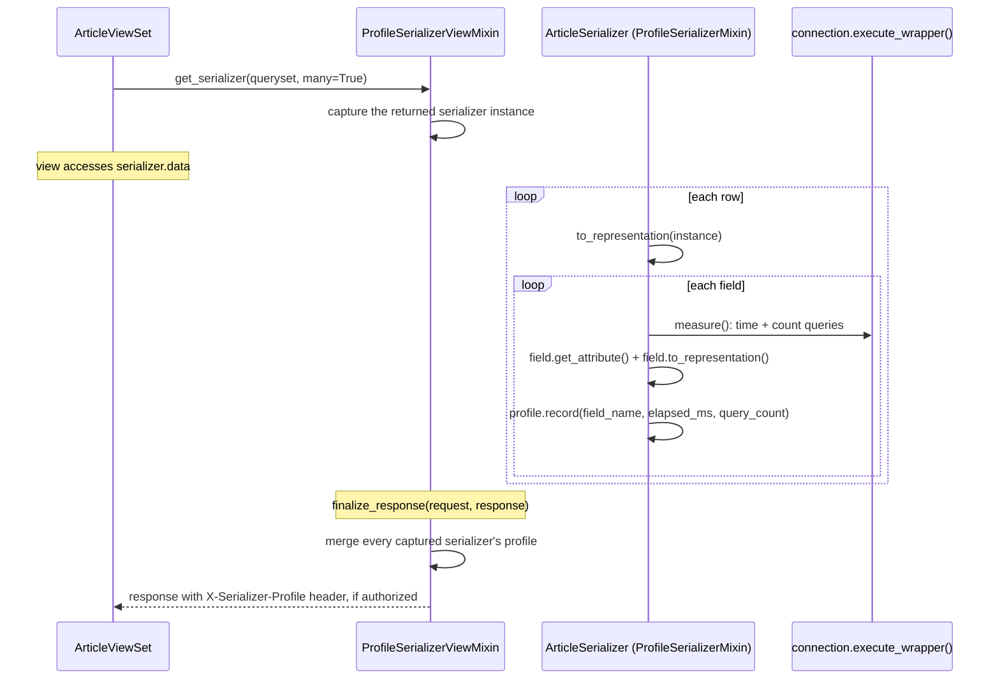

# Architecture

## Request pipeline



## Module map

| Module | Responsibility |
| --- | --- |
| `mixins` | `ProfileSerializerMixin` (per-field measurement) + `ProfileSerializerViewMixin` (response header). |
| `profiling` | `FieldProfile`/`SerializerProfile` data shapes, `measure()` (the timing + query-counting primitive), `merge_profiles()`, `get_serializer_profile()`. |
| `settings` | The `SERIALIZER_PROFILER` setting. |

## The core guarantee: identical output to a plain serializer

This package's entire value proposition depends on one property
holding exactly: mixing in `ProfileSerializerMixin` must never change
what a serializer produces. `to_representation()` is therefore written
to be *line-for-line* equivalent to DRF's own
`Serializer.to_representation()`, with measurement inserted around
(not instead of) each field:

```python
# DRF's own Serializer.to_representation
def to_representation(self, instance):
    ret = {}
    fields = self._readable_fields
    for field in fields:
        try:
            attribute = field.get_attribute(instance)
        except SkipField:
            continue
        check_for_none = attribute.pk if isinstance(attribute, PKOnlyObject) else attribute
        if check_for_none is None:
            ret[field.field_name] = None
        else:
            ret[field.field_name] = field.to_representation(attribute)
    return ret
```

```python
# ProfileSerializerMixin.to_representation
def to_representation(self, instance):
    if not get_setting("ENABLED") and not get_setting("LOG_SLOW_FIELDS"):
        return super().to_representation(instance)  # zero overhead when off

    ret = {}
    fields = self._readable_fields
    profile = get_serializer_profile(self) or SerializerProfile()
    self._serializer_profile = profile
    for field in fields:
        with measure() as measurement:
            try:
                attribute = field.get_attribute(instance)
            except SkipField:
                continue
            check_for_none = attribute.pk if isinstance(attribute, PKOnlyObject) else attribute
            if check_for_none is None:
                ret[field.field_name] = None
            else:
                ret[field.field_name] = field.to_representation(attribute)
        profile.record(field.field_name, measurement.elapsed_ms, measurement.query_count)
    return ret
```

Same iteration over `self._readable_fields`, same `get_attribute()` +
`SkipField` handling, same `PKOnlyObject`/`None` check, same
`to_representation()` call - the only addition is the `measure()`
context manager wrapped around each field's work, and
`profile.record(...)` afterward. This is verified directly in
`tests/test_mixins.py`'s `TestOutputIsUnchanged`, which asserts
byte-identical `.data` against both a disabled-profiler run and a
completely separate, undecorated `ModelSerializer`.

## Why the profile accumulates across rows instead of resetting each time

`get_serializer_profile(self) or SerializerProfile()` reuses an
existing profile if one is already attached to `self`, rather than
always creating a fresh one. This matters specifically for a
`many=True` (list) serializer: DRF's `ListSerializer.to_representation()`
reuses a *single* `self.child` instance, calling
`self.child.to_representation(item)` once per row in the queryset -
so without accumulation, each row's measurement would overwrite the
previous row's, leaving only the *last* row's numbers. With
accumulation, `FieldProfile.total_time_ms`/`.call_count`/`.query_count`
correctly sum across every row, which is what makes the response
header useful for spotting an N+1 pattern at all: a field whose query
count scales with the number of rows in the response (rather than
staying constant) is the signal to look for.

## Why query counting wraps every configured database connection

`profiling.measure()` calls `connection.execute_wrapper()` (a public
Django hook, stable since Django 3.0) on *every* alias returned by
`django.db.connections.all()`, not just `"default"` - the same
technique this workspace's `drf-n-plus-one-query-guard` package uses.
A field might query a non-default database (a read replica, a
secondary analytics database) - wrapping only `"default"` would
silently undercount queries for any field that doesn't use it.

## Why `finalize_response` (not middleware) attaches the header

`ProfileSerializerViewMixin` needs the *serializer instances* created
during the request (to read their `_serializer_profile`) - a Django
middleware operating on the plain `HttpRequest`/`HttpResponse` has no
access to those instances at all, since they're local to the view.
`finalize_response` is the DRF-level hook that runs with the view
instance (and, via `_profiled_serializers`, every serializer it
created) still in scope, right before the response leaves the view
layer - the same pattern this workspace's other response-header
packages (`drf-permission-debugger`, `drf-api-versioning`) already use.

## Why `get_serializer()` must handle a `ListSerializer`'s `.child` specially

`GenericAPIView.get_serializer(queryset, many=True)` returns a
`ListSerializer` instance wrapping the actual `ArticleSerializer` as
its `.child` - `ProfileSerializerViewMixin.get_serializer()` captures
whatever `get_serializer()` returns (the `ListSerializer`), but the
*profile* itself only ever gets attached to `.child` (since that's the
instance whose `to_representation()` actually runs, once per row).
`finalize_response()` therefore checks both the captured instance
directly and its `.child` attribute when looking for a profile to
merge - `get_serializer_profile(serializer) or
get_serializer_profile(getattr(serializer, "child", None))`.
